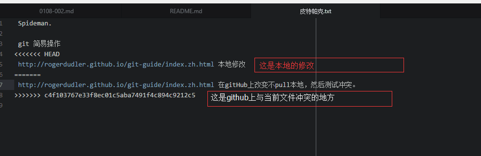

## 关于如何处理github上的一些简单冲突
冲突产生的原因：
- 提交的文件是相同，且修改的地方相同但是修改的文字不同
- 你在github上修改了，又在本地修改相同文件的相同地方提交  

如何避免：
- 本地写的时候就先pull下。

如何改正：
- 先pull下到本地，会呈现为下面这样的格式：

```
<<<<<<< HEAD
 http://rogerdudler.github.io/git-guide/index.zh.html 本地修改
=======
 http://rogerdudler.github.io/git-guide/index.zh.html 在gitHub上改变不pull本地，然后测试冲突。
>>>>>>> c4f103767e33f8ec01c5aba7491f4c894c9212c5
```

>简单来说，"======="号以前的是本地修改，以后的就是远程服务器的文件状态

- 我的思路是这样：（无比较冲突的工具下）
- 要么先修改成远程服务器的样子，自己备份一个自己的。要么就删除整个冲突。这适用于小冲突且不重要。
- 要么就使用工具，具体参考如下：
    [使用IDEA修改git冲突][1]

*[如何克服解决 Git 冲突的恐惧症？][2]*


[1]:https://www.zhihu.com/question/21215715/answer/201900253
[2]:https://www.zhihu.com/question/27507789/answer/201901826
